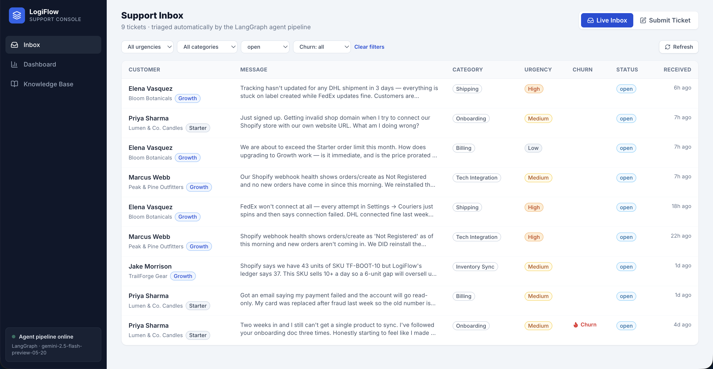
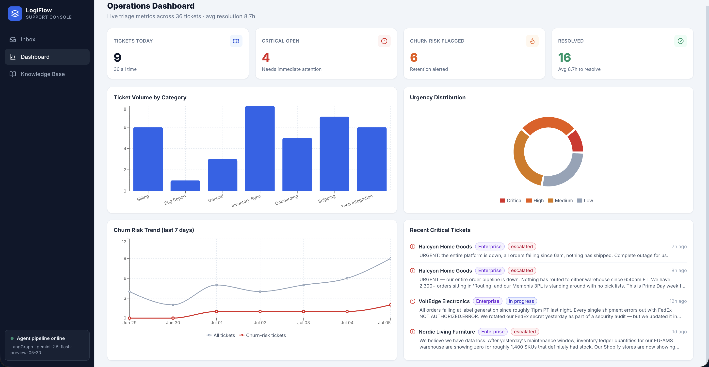
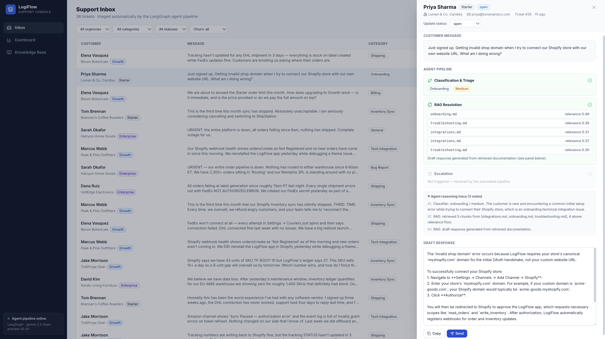
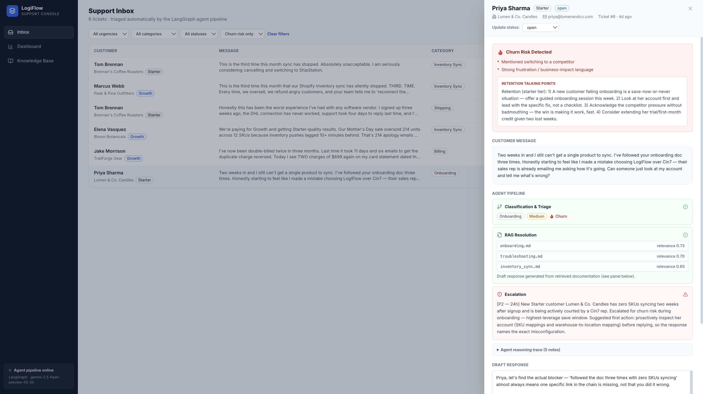
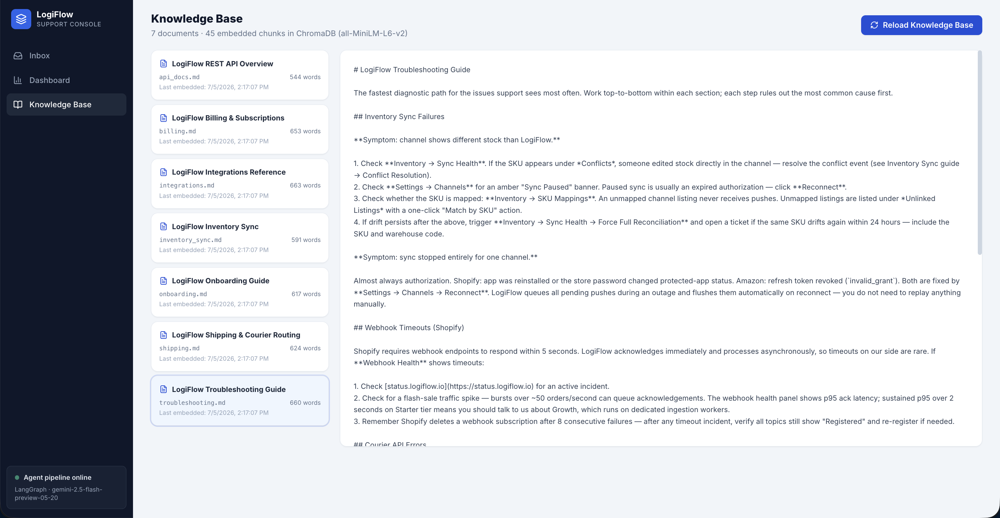
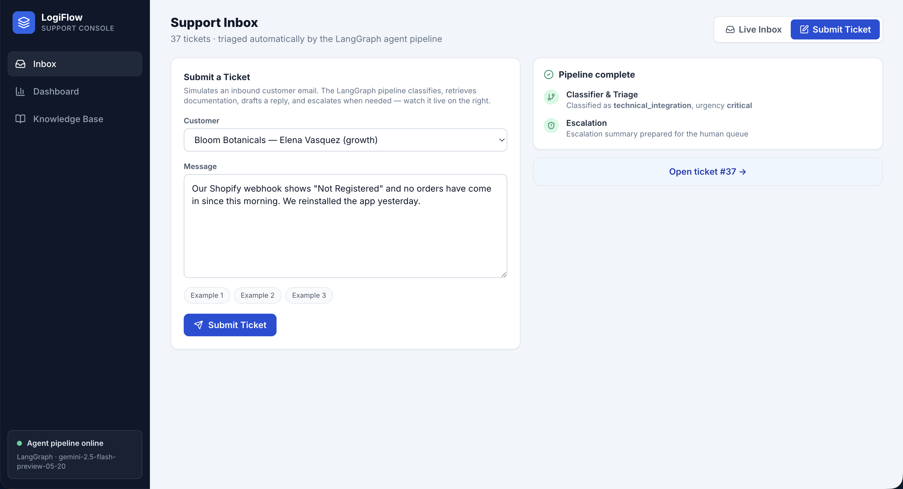
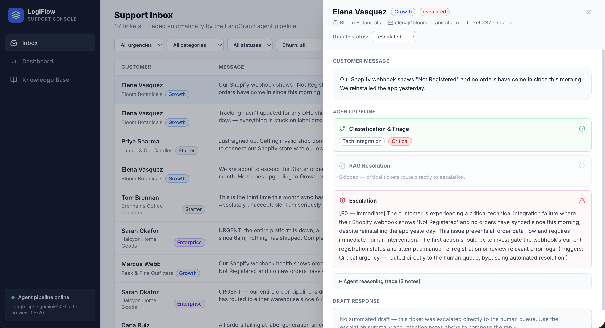

# ZENIVIXON — Autonomous Customer Support & Triage Agent

ZENIVIXON (formerly LogiFlow) is an enterprise support console and autonomous ticket triage system. Driven by a stateful LangGraph multi-agent pipeline, it automatically classifies inbound tickets, retrieves relevant knowledge base articles, and resolves inquiries via grounded RAG—seamlessly escalating complex cases to human workflows.

The system pairs a multi-agent backend orchestration layer (LangGraph + Gemini + FastAPI) with a modern web dashboard (Next.js 16 + Tailwind v4).

## Highlights

- **Multi-agent orchestration with LangGraph** — A robust stateful graph that processes tickets through sequential stages: intake, verification, tool execution, resolution, and final safety guardrails before deciding to automatically resolve or escalate to a human.
- **Modern Infrastructure** — Fully containerized backing services using Docker Compose, including PostgreSQL (relational data), Qdrant (vector search for RAG), and Redis.
- **Grounded AI** — RAG agent powered by Google Gemini and `models/text-embedding-004`, ensuring responses are grounded in your actual knowledge base.

## Architecture

```text
                          ┌─────────────────────┐
                          │        START        │
                          └──────────┬──────────┘
                                     │
                          ┌──────────▼──────────┐
                          │       intake        │
                          └──────────┬──────────┘
                                     │
                          ┌──────────▼──────────┐
                          │       verify        │
                          └──────────┬──────────┘
                                     │
                          ┌──────────▼──────────┐
                          │        tools        │
                          └──────────┬──────────┘
                                     │
                          ┌──────────▼──────────┐
                          │      resolution     │
                          └──────────┬──────────┘
                                     │
                          ┌──────────▼──────────┐
                          │       safety        │
                          └──────────┬──────────┘
                                     │
              ┌──────────────────────┴───────────────────────┐
        [is_safe: true]                                [is_safe: false]
              ▼                                              ▼
       ┌─────────────┐                                ┌────────────┐
       │   resolve   │                                │ escalation │
       └──────┬──────┘                                └──────┬─────┘
              │                                              │
              └──────────────────────┬───────────────────────┘
                                     ▼
                                    END
```

**Tech Stack:**
- **Backend:** FastAPI + SQLAlchemy, LangGraph, Gemini API (`models/text-embedding-004`)
- **Infrastructure:** Docker Compose (PostgreSQL `zenivixon_db`, Qdrant, Redis)
- **Frontend:** Next.js 16 (App Router), React 19, Tailwind CSS v4

---

## Setup

### Prerequisites
- Docker & Docker Compose
- Node.js v20+
- Python 3.10+

### 1. Infrastructure
Start the required databases (PostgreSQL, Qdrant, Redis):
```bash
docker-compose up -d
```

### 2. Backend
Navigate to the backend directory, create a virtual environment, and run the server:
```bash
cd backend
python3 -m venv .venv
source .venv/bin/activate
# Note: Ensure you install necessary dependencies (fastapi, uvicorn, sqlalchemy, langgraph, langchain-google-genai, qdrant-client, etc.)

export GEMINI_API_KEY="your_api_key_here"
export QDRANT_URL="http://localhost:6333"

uvicorn main:app --reload --port 8000
```
*(The API will be available at `http://localhost:8000`)*

### 3. Frontend
Navigate to the frontend directory and start the Next.js development server:
```bash
cd frontend
npm install
npm run dev
```
*(The web UI will be available at `http://localhost:3000`)*

---

## API Surface (FastAPI)

| Endpoint | Purpose |
|---|---|
| `POST /api/tickets` | Submit a new ticket; executes the LangGraph workflow |
| `GET /api/dashboard/stats` | Retrieves current KPIs, resolved/escalated counts, and resolution rates |

---

## Screenshots

*(Note: UI screenshots from previous iteration "LogiFlow")*

| | |
|---|---|
| **Live Inbox** — filterable by urgency, category, status, and churn risk |  |
| **Operations Dashboard** — KPIs, category/urgency breakdowns, 7-day churn trend, critical feed |  |
| **Ticket detail** — full agent pipeline trace with retrieved doc relevance scores and editable draft |  |
| **Churn-risk escalation** — flagged signals, tier-specific retention talking points |  |
| **Knowledge Base** — browsable source docs with embedding stats and reload |  |
| **Submit Ticket** — live LangGraph progress as each agent completes |  |
| **Critical path** — urgency=critical skips RAG and routes straight to escalation |  |
